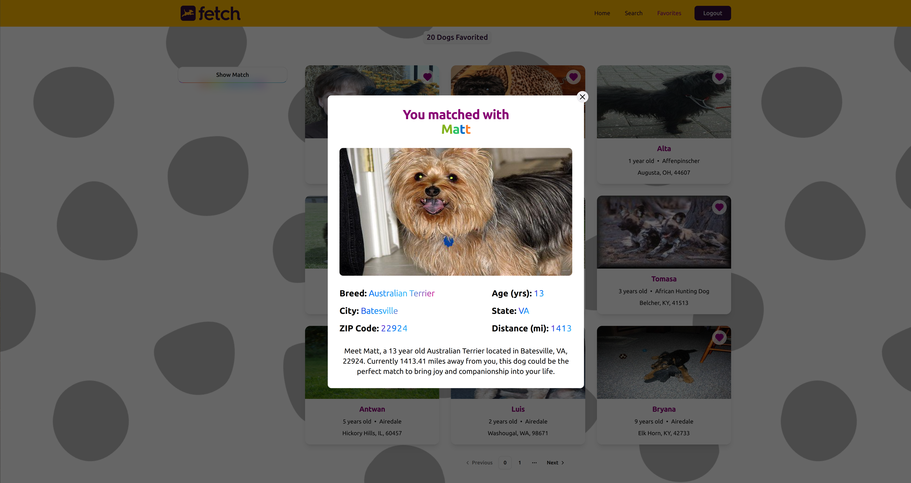

<h1 align='center'>FetchMatch</h1>

<div align="center">
   
</div>

<div align='center'>Find your new best friend! A dog adoption platform with a catalog of over 10000 dogs!</div>

## Domain

https://fetch-match-theta.vercel.app/

## Features

- Diverse Catalog - 10000+ shelter dogs across 120 breeds to choose from
- Plenteous Customization - Filter through dogs using,
  - Location - City, State, ZIP Code
  - breed
  - min age
  - max age
- Preferential Ordering - Sort through dogs in both directions across,
  - breed
  - name
  - age
- Curated Dogs Data - Get information & images for all dogs
- User Matching - Select favorite dogs and generate a Match
- Responsive Design - Unique, Mobile-Friendly Layouts created with [Material Tailwind](https://www.material-tailwind.com/) & [Shadcn](https://ui.shadcn.com/) components
- Seamless Animations/Transitions - Made possible with [Motion](https://motion.dev/)
- Client-side routing with Exclusive pages - Implemented with [React Router](https://reactrouter.com/)
- Flawless Integration - Comprehensive Integration Testing carried out using [Vitest](https://vitest.dev/) & [Testing Library](https://testing-library.com/)

## Technologies


## Screenshots

<div align="center">
   
   
   
   
   
</div>

## Instructions to run the project locally

1. Clone the repository

```bash
  git clone https://github.com/Suryakumar-Selvakumar/FetchMatch.git
  cd FetchMatch
```

2. Install dependencies

   Make sure you have Node.js (v18 or above) installed.

```bash
  npm install
```

3. Run the development server

   This command will start the Vite development server. Open your browser and go to: http://localhost:5173

```bash
  npm run dev
```

## Project Plan

For a detailed thought process and planning behind building this project, please refer to the [Project Plan Document](./project-plan.md).
